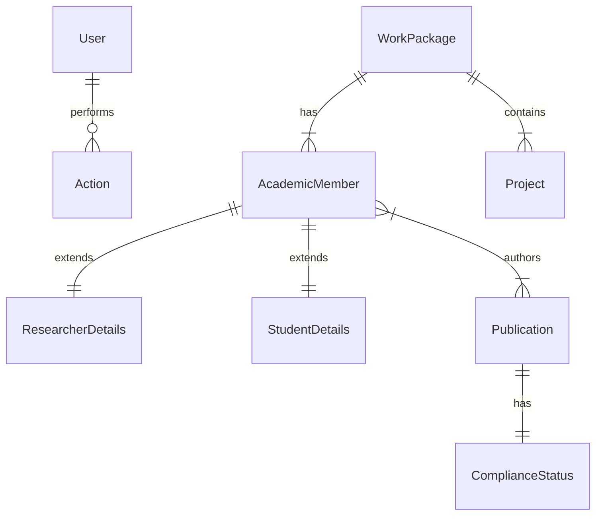

# Backend CECAN - Guía de Inicio para Desarrolladores

> [!NOTE]
> **Convención de Comandos Python**: En esta documentación utilizamos `python` para todos los comandos. Si estás en **macOS o Linux**, es posible que necesites usar `python3` en lugar de `python` si tu sistema no tiene configurado un alias. Puedes verificarlo ejecutando `python --version` en tu terminal.

## 📋 Descripción General

Backend profesional para la plataforma **CECAN** (Centro de Excelencia en Cáncer), implementado con **FastAPI** siguiendo principios de **Clean Architecture**. Proporciona APIs RESTful para gestión de investigadores, publicaciones, cumplimiento normativo (compliance), y un sistema RAG (Retrieval-Augmented Generation) con IA.

---

## 🚀 Inicio Rápido (Quick Start)

Para desarrolladores nuevos que quieren tener el servidor corriendo rápidamente:

### 1️⃣ Prerrequisitos

- **Python 3.10 o superior** instalado en tu sistema
- **Pip** (administrador de paquetes de Python)
- **Git** (para clonar el repositorio)

### 2️⃣ Clonar el Repositorio (si aún no lo tienes)

```bash
git clone <url-del-repositorio>
cd backend
```

### 3️⃣ Crear un Entorno Virtual (Recomendado)

**Windows (PowerShell o CMD):**

```bash
python -m venv venv
venv\Scripts\activate
```

**macOS/Linux:**

```bash
python3 -m venv venv
source venv/bin/activate
```

> [!TIP]
> Usar un entorno virtual mantiene las dependencias del proyecto aisladas de tu instalación global de Python. Verás `(venv)` al inicio de tu terminal cuando el entorno esté activado.

### 4️⃣ Instalar Dependencias

```bash
pip install -r requirements.txt
```

> [!IMPORTANT]
> Si encuentras errores con `bcrypt`, asegúrate de que se instale la versión específica:
>
> ```bash
> pip install bcrypt==4.0.1
> ```

### 5️⃣ Configurar Variables de Entorno

Crea un archivo `.env` en la carpeta `backend/` con el siguiente contenido:

```env
# Google AI (Para RAG y Chat)
GOOGLE_API_KEY=tu_api_key_aqui

# Base de Datos
DB_PATH=cecan.db

# Seguridad
SECRET_KEY=tu_clave_secreta_super_segura
ALGORITHM=HS256
ACCESS_TOKEN_EXPIRE_MINUTES=30

# CORS (URLs permitidas para acceder a la API)
CORS_ORIGINS=["http://localhost:3000", "http://localhost:8000"]
```

> [!TIP]
> Para generar un `SECRET_KEY` seguro, puedes usar Python:
>
> ```bash
> python -c "import secrets; print(secrets.token_urlsafe(32))"
> ```

### 6️⃣ Inicializar la Base de Datos

El proyecto utiliza **SQLite**, una base de datos ligera que **no requiere instalar servidores** como PostgreSQL o MySQL. Los datos se almacenan en un archivo local llamado `cecan.db` que se creará automáticamente.

#### a) Crear las Tablas

```bash
python -m database.init
```

**macOS/Linux:**

```bash
python3 -m database.init
```

✅ **Resultado esperado:** Verás un mensaje confirmando que las tablas fueron creadas exitosamente. Se habrá generado el archivo `cecan.db` en la carpeta `backend/`.

#### b) Crear Usuario Administrador (Seed)

Este comando crea un usuario de prueba para que puedas iniciar sesión:

```bash
python -m database.seed
```

**macOS/Linux:**

```bash
python3 -m database.seed
```

**Credenciales por defecto:**

- **Email:** `admin@cecan.cl`
- **Contraseña:** `admin123`

> [!CAUTION]
> Recuerda cambiar estas credenciales en un entorno de producción.

### 7️⃣ Ejecutar el Servidor 🚀

¡Llegó el momento de levantar el servidor! Ejecuta el siguiente comando:

**Para Desarrollo (con recarga automática):**

```bash
uvicorn main:app --reload
```

**macOS/Linux:**

```bash
python3 -m uvicorn main:app --reload
```

**¿Qué hace el flag `--reload`?**
Activa la recarga en caliente (hot-reload): cada vez que guardes cambios en el código, el servidor se reiniciará automáticamente. **Perfecto para desarrollo, NO usar en producción.**

**Para Producción (sin recarga automática):**

```bash
uvicorn main:app --host 0.0.0.0 --port 8000
```

✅ **¡Listo!** El servidor estará corriendo en: [http://localhost:8000](http://localhost:8000)

### 8️⃣ Explorar la API

Una vez iniciado el servidor, puedes explorar la documentación interactiva:

- **Swagger UI (Interfaz Interactiva):** [http://localhost:8000/docs](http://localhost:8000/docs)
- **ReDoc (Documentación Clara):** [http://localhost:8000/redoc](http://localhost:8000/redoc)
- **Health Check:** [http://localhost:8000/health](http://localhost:8000/health)

---

## 📁 Estructura del Proyecto

El backend está diseñado para ser modular y escalable:

```
backend/
├── api/
│   └── routes/           # Endpoints de la API
│       ├── auth.py       # Autenticación (JWT)
│       ├── public.py     # Endpoints públicos (Web)
│       ├── catalogs.py   # Catálogos (WPs, colores)
│       ├── reports.py    # Reportes y exportación Excel
│       ├── rag.py        # Chat con IA (RAG)
│       └── ...
├── core/
│   └── models.py         # Modelos de Base de Datos (SQLAlchemy)
├── database/
│   ├── init.py           # Script de creación de tablas
│   ├── seed.py           # Script de creación de usuario admin
│   └── legacy_wrapper.py # Compatibilidad con grafo legacy
├── migrations/           # Scripts de migración de datos
├── services/             # Lógica de negocio (Auth, RAG, Scraper)
├── scripts/              # Scripts de utilidad (Verificación API)
├── config.py             # Configuración centralizada
├── main.py               # Punto de entrada de la aplicación
├── requirements.txt      # Dependencias de Python
└── .env                  # Variables de entorno (NO subir a Git)
```

---

## 🗄️ Arquitectura de Base de Datos

El sistema utiliza **SQLite** como motor de base de datos relacional, gestionado principalmente a través de **SQLAlchemy (ORM)**.

### ¿Qué es SQLite?

SQLite es una base de datos **embebida** que almacena toda la información en un solo archivo (en este caso, `cecan.db`). A diferencia de PostgreSQL o MySQL, **no necesitas instalar ni configurar un servidor de base de datos**. Es perfecta para desarrollo y aplicaciones de tamaño pequeño a mediano.

**Ubicación del archivo:** `backend/cecan.db` (se crea automáticamente al ejecutar el script de inicialización)

### Modelo de Datos (Schema)

El esquema está diseñado para soportar la gestión académica y el cumplimiento normativo.

#### 1. Usuarios y Autenticación

- **`users`**: Usuarios del sistema (Admin, Editor, Viewer).
  - `id`, `email`, `hashed_password`, `role`, `is_active`.

#### 2. Miembros Académicos (Core)

- **`academic_members`**: Tabla central para todas las personas (Investigadores, Estudiantes, Staff).
  - `id`, `full_name`, `rut`, `email`, `member_type` (researcher/student/staff).
  - `wp_id` (FK -> `wps`): Working Package principal.
- **`researcher_details`**: Detalles específicos para investigadores.
  - `member_id` (FK -> `academic_members`), `category` (Principal/Asociado), `indice_h`, `citaciones`.
- **`student_details`**: Detalles específicos para estudiantes.
  - `member_id` (FK -> `academic_members`), `tutor_id` (FK), `thesis_title`, `program`.

#### 3. Publicaciones y Compliance

- **`publicaciones`**: Papers y artículos científicos.
  - `id`, `titulo`, `doi`, `fecha`, `journal`.
  - **Auditoría**: `has_valid_affiliation`, `has_funding_ack`, `anid_report_status`.
- **`investigador_publicacion`**: Tabla intermedia (Many-to-Many) con scoring de coincidencia.
  - `investigador_id`, `publicacion_id`, `match_score`, `match_method` (manual/fuzzy).

#### 4. Estructura Organizacional (Legacy & New)

- **`wps`**: Working Packages (Líneas de investigación).
  - `id`, `nombre`.
- **`proyectos`**: Proyectos de investigación asociados a WPs.
- **`nodos`**: Conceptos temáticos para el grafo de conocimiento.

### Diagrama de Relaciones Simplificado



### Sistema Híbrido (Legacy vs Modern)

El backend mantiene compatibilidad con datos históricos:

- **Tablas Modernas (SQLAlchemy):** `users`, `academic_members`, `compliance_status`. Usadas para la gestión diaria y la API nueva.
- **Tablas Legacy (SQLite Raw):** `Investigadores` (antigua), `Nodos`, `Proyectos`. Usadas principalmente para la visualización del **Grafo de Red** (`/api/public/graph`).
- **Sincronización:** Existen scripts (`migrations/`) para mover datos del mundo Legacy al Moderno.

---

## 🔌 Endpoints Principales (API Reference)

### 🔐 Autenticación (`/api/auth`)

- `POST /login`: Obtener token de acceso.
- `GET /me`: Obtener perfil del usuario actual.

### 🌍 Públicos (`/api/public`)

- `GET /researchers`: Lista de investigadores para el sitio web (datos sanitizados).
- `GET /graph`: Datos del grafo de red (nodos y aristas) para visualización.

### 📂 Catálogos (`/api/catalogs`)

- `GET /working-packages`: Lista de WPs con sus colores asignados.

### 📊 Reportes (`/api/reports`)

- `GET /compliance/export`: Descarga reporte Excel de cumplimiento (Requiere rol Editor).
- `GET /summary`: Resumen de métricas por WP.

### 🤖 RAG & IA (`/api/rag`)

- `POST /chat`: Conversar con el agente inteligente.
- `GET /stats`: Estadísticas del sistema de conocimiento.

---

## 🛠️ Herramientas de Gestión de Datos (Scripts Avanzados)

El backend incluye una suite de scripts avanzados para la gestión y enriquecimiento de datos en `backend/scripts/`:

### 📚 Gestión de Publicaciones

- `sync_publications.py`: Sincroniza publicaciones desde la web.
- `enrich_final_regex.py`: **[CRÍTICO]** Extrae metadatos (autores, fecha, resumen) de la web usando regex avanzado.
- `generate_urls.py`: Genera URLs canónicas para las publicaciones.
- `find_duplicates.py` & `clean_database.py`: Detecta y elimina publicaciones duplicadas.

### 🔗 Matching de Investigadores

- `add_name_variations.py`: Genera variaciones de nombres (ej: "Juan Pérez" -> "J. Pérez") para mejorar el matching.
- `fix_problematic_names.py`: Corrige nombres concatenados erróneos.
- `run_matching_improved.py`: **[CRÍTICO]** Vincula investigadores con publicaciones usando algoritmos fuzzy y variaciones de nombres.
- `matching_reports.py`: Genera reportes detallados de productividad y colaboración.

### 🆔 Integración ORCID

- `setup_and_extract_orcids.py`: Extrae ORCIDs desde los PDFs locales.
- `improve_orcid_extraction.py`: Extracción profunda de ORCIDs (links + texto plano).
- `match_orcids_with_api.py`: Valida ORCIDs con la API oficial y los asigna a los investigadores.

### ✅ Auditoría y Compliance

- `audit_compliance.py`: Verifica automáticamente si las publicaciones mencionan a "CECAN" o "FONDAP" en sus agradecimientos.

---

## 📋 Flujo de Trabajo Recomendado (Data Pipeline)

Para actualizar completamente la base de datos, sigue este orden:

1. **Sincronización:**

   ```bash
   python scripts/sync_publications.py
   ```
2. **Enriquecimiento:**

   ```bash
   python scripts/enrich_final_regex.py
   ```
3. **Limpieza:**

   ```bash
   python scripts/clean_database.py
   ```
4. **Matching:**

   ```bash
   python scripts/add_name_variations.py
   python scripts/run_matching_improved.py
   ```
5. **ORCID:**

   ```bash
   python scripts/improve_orcid_extraction.py
   python scripts/match_orcids_with_api.py
   ```
6. **Auditoría:**

   ```bash
   python scripts/audit_compliance.py
   ```

> [!NOTE]
> **macOS/Linux:** Recuerda reemplazar `python` por `python3` en todos los comandos anteriores si tu sistema lo requiere.

---

## 🐛 Solución de Problemas Comunes (Troubleshooting)

### ❌ Error: `ModuleNotFoundError: No module named 'backend'`

**Causa:** Estás ejecutando el comando desde el directorio incorrecto o no estás usando el formato de módulo correcto.

**Solución:**

- Asegúrate de estar en la carpeta `backend/` cuando ejecutes los comandos.
- Usa `python -m` para scripts que son módulos (como `database.init`).

```bash
cd backend  # Asegúrate de estar aquí
python -m database.init
```

---

### ❌ Error: `500 Internal Server Error` en Login

**Causa:** Versión incompatible de `bcrypt`.

**Solución:**

```bash
pip install bcrypt==4.0.1
```

---

### ❌ Base de datos vacía o tablas no existen

**Causa:** No se ejecutaron correctamente los scripts de inicialización.

**Solución:**

1. Elimina el archivo `cecan.db` si existe.
2. Vuelve a ejecutar:
   ```bash
   python -m database.init
   python -m database.seed
   ```

---

### ❌ Error: `command not found: uvicorn`

**Causa:** Uvicorn no está instalado o no está en el PATH del entorno virtual.

**Solución:**

- Si estás dentro del entorno virtual (`venv` activo), intenta:
  ```bash
  pip install uvicorn[standard]
  ```
- O usa el módulo de Python directamente:
  ```bash
  python -m uvicorn main:app --reload
  ```

---

### ❌ Error: `python3: command not found` (Windows)

**Causa:** En Windows, el comando es `python`, no `python3`.

**Solución:** Usa `python` en lugar de `python3`:

```bash
python -m database.init
```

---

### ❌ Puerto 8000 ya está en uso

**Causa:** Otro proceso está usando el puerto 8000.

**Solución:**

- **Opción 1:** Detén el proceso que usa el puerto.
- **Opción 2:** Usa otro puerto:
  ```bash
  uvicorn main:app --reload --port 8001
  ```

---

## 📖 Recursos Adicionales

- **Documentación de FastAPI:** [https://fastapi.tiangolo.com](https://fastapi.tiangolo.com)
- **Documentación de SQLAlchemy:** [https://www.sqlalchemy.org](https://www.sqlalchemy.org)
- **Documentación de Uvicorn:** [https://www.uvicorn.org](https://www.uvicorn.org)

---

## 🤝 Contribuciones

Si encuentras errores o tienes sugerencias para mejorar el proyecto, por favor contacta al equipo de desarrollo o abre un issue en el repositorio.

---

## 📝 Licencia

Este proyecto es parte de CECAN (Centro de Excelencia en Cáncer) y está destinado únicamente para uso interno de investigación académica.
